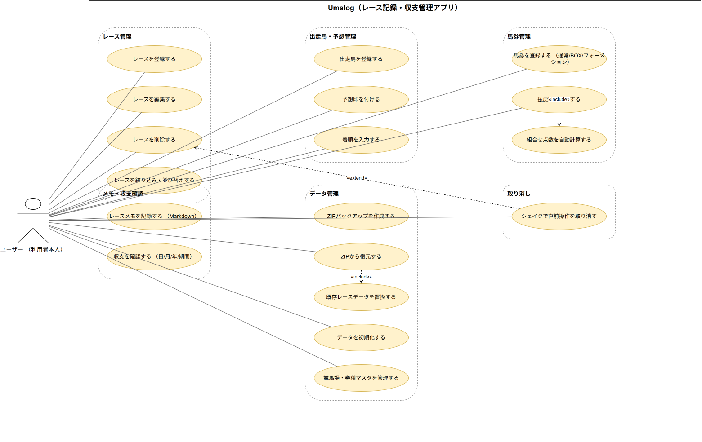
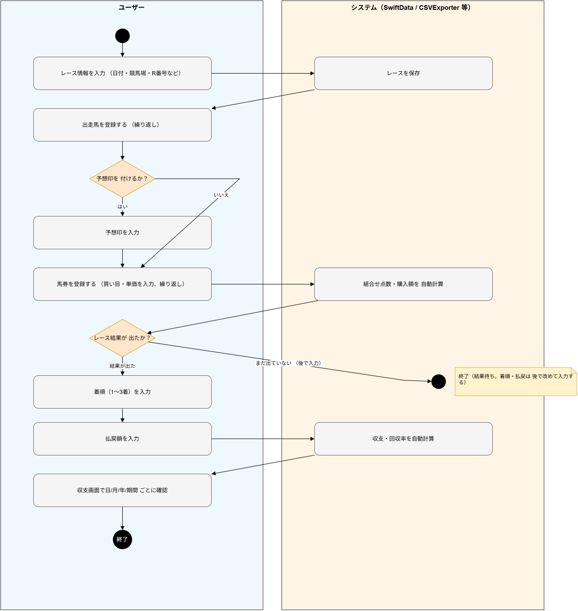
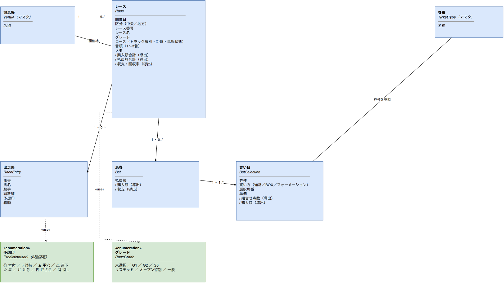
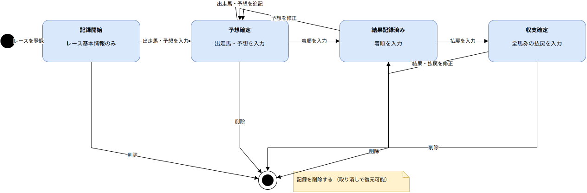
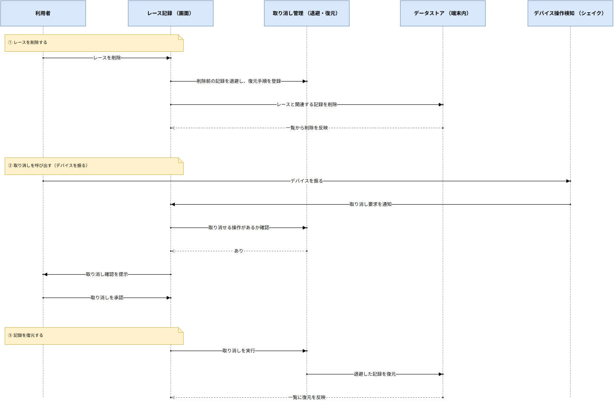

# Umalog アーキテクチャ設計書

本書はUmalogの設計をUMLで示すものです。実装の詳細ではなく、システムとしてあるべき構造と振る舞い、すなわち責務とその関係に焦点を当てて記述します。各図の元データは[docs/uml](uml)配下にdrawio形式で置いてあり、draw.ioで編集できます。

## 1. システム全体像

Umalogは、利用者が自身の競馬予想と収支を記録・振り返るための、単一利用者・単一デバイス向けアプリケーションです。

設計原則（ゆずれない前提）:

- **ローカル完結**: データは端末内に閉じ、外部へ送信しない。サーバーやアカウントを持たない
- **プライバシーファースト**: 利用者のデータが端末外へ出ないことを最優先とする
- **完全無料・無制限**: 課金・利用制限を設けない
- **記録専用**: 投票・購入といった賭け行為への導線を一切持たない

構成方針:

- **プレゼンテーション**（画面）・**ドメインモデル**（記録対象の概念）・**永続化**（端末内保存）の3つの関心事に分離する
- 業務ロジックは軽量で、画面がドメインモデルを直接扱う薄い構成とする。集計・点数計算などの派生値はモデルから導出する
- 画面領域は「記録」（レースの一覧・詳細・入力）、「収支集計」、「設定・データ管理」の3つに大別される

---

## 2. ユースケース図

要件（誰が何をしたいか）を表します。アクターは「利用者本人」ただ1人で、外部システムや他者は関与しません（単独利用）。

- **レース管理**: レースの登録・編集・削除・絞り込み／並び替え
- **出走馬・予想管理**: 出走馬の登録、予想印付け、着順入力
- **馬券管理**: 馬券登録（通常／BOX／フォーメーション）と払戻入力。組合せ点数の自動算出は登録に内包される
- **メモ・収支確認**: レースメモの記録、日／月／年／期間別の収支確認
- **データ管理**: バックアップの作成・復元、データ初期化、競馬場／券種マスタの管理
- **取り消し**: 直前の削除操作を取り消す（削除の安全網として機能する）

---

## 3. アクティビティ図

処理・業務の流れを表します。利用者とシステムの2レーンで、レース登録から収支確認までの基本フローを示します。

ポイント:

- 予想印の入力は任意（省略して馬券登録へ進める）
- 購入額・組合せ点数はシステムが自動算出し、利用者は買い目と単価の入力に集中できる
- レース結果が未確定の時点で一旦終了してよく、着順・払戻は後から改めて入力できる
- 収支・回収率は入力内容から都度自動算出され、利用者が手計算する必要はない

---

## 4. クラス図

静的な構造（骨格）を表します。ここでは記録対象の概念とその関係を示すドメインモデルであり、保存形式や型といった実装上の詳細は捨象しています。

主な概念と関係:

- **レース**を中心に、その参加者である**出走馬**と、投じた**馬券**がぶら下がる
- **馬券**は1つ以上の**買い目**から成り、買い目ごとに券種・買い方・選択馬・単価を持つ
- **競馬場**と**券種**は複数のレース・買い目から参照されるマスタ概念。マスタが失われても、それを参照していた記録自体は残る（記録の独立性を保つ）
- 購入額・払戻額・収支・回収率は個々の記録から導出される派生値であり、独立に保持しない（二重管理を避ける）
- **予想印**は8種の固定値、**グレード**も列挙された値の集合として扱う

関係の強さ:

- レースと出走馬・馬券、馬券と買い目は**コンポジション**（親を消せば子も消える一体の記録）
- 競馬場・券種と記録の間は**参照**（片方を消してももう片方は独立して残る）

---

## 5. ステートマシン図

動的な振る舞い①：状態の変化を表します。1件のレース記録が、利用者の記録作業の進行に伴ってたどるライフサイクルを示します。これは記録の充足度から導かれる概念的な状態であり、明示的な状態区分をデータとして持つわけではありません。

- **記録開始**: レースの基本情報だけがある段階
- **予想確定**: 出走馬と予想を入力し、レースに臨む段階
- **結果記録済み**: 着順を入力し、レース結果が判明した段階
- **収支確定**: 全馬券の払戻を入力し、そのレースの損益が確定した段階
- いずれの段階からも記録は削除でき、削除は取り消し（Undo）によって元の状態へ復元できる

各段階は前後に自由に行き来でき、後から予想や結果を修正できる柔軟さを持たせています。

---

## 6. シーケンス図

動的な振る舞い②：やり取りの順番を表します。本アプリを特徴づける「削除と、その取り消し（Undo）」のやり取りを取り上げます。

- 削除に先立ち、システムは削除対象の記録を退避し、元に戻すための手順を取り消し管理に登録する。これにより、削除後でも復元が可能になる
- 利用者はデバイスを振る操作で取り消しを呼び出せる。システムは取り消し可能な操作があるか確認し、確認ダイアログを提示する
- 利用者が承認すると、退避しておいた記録が復元され、一覧に元通り表示される

削除を即時に確定させず「退避 → 確認 → 復元」の余地を常に残すことで、誤操作に強い記録体験を実現します。

---

## 7. アーキテクチャ上の申し送り事項

- **記録形式の変更と移行**: 記録の内部表現を変更する際は、既存データを新形式へ移行する経路を必ず用意する。移行なしの形式変更は過去記録の欠損につながる
- **バックアップの同一性判定**: エクスポート／インポートでは記録を論理的なキー（開催日・競馬場・レース番号など人が識別できる属性）で突き合わせる。同一キーの記録が重複しうる設計変更を行う場合は、取り違えが起きないようキーの一意性を再検討する
- **取り消し（Undo）の一貫性**: 削除を伴う操作には「削除前の退避」と「復元手順の登録」が対で必要になる。削除可能な対象を増やすときは、この対を欠かさない
- **入力ジェスチャの前提**: 取り消しをデバイスのシェイクに依存させている。シェイクを前提にできないプラットフォームへ展開する場合は、代替の取り消し導線を別途用意する
- **外部データ取得と非機能要件の緊張関係**: 出走馬情報などの自動取得は「ローカル完結・外部送信なし」という前提と衝突しうる。取り込む場合も、アプリが自発的に通信しない設計（利用者が明示的に持ち込んだデータのみを扱う等）を守る
