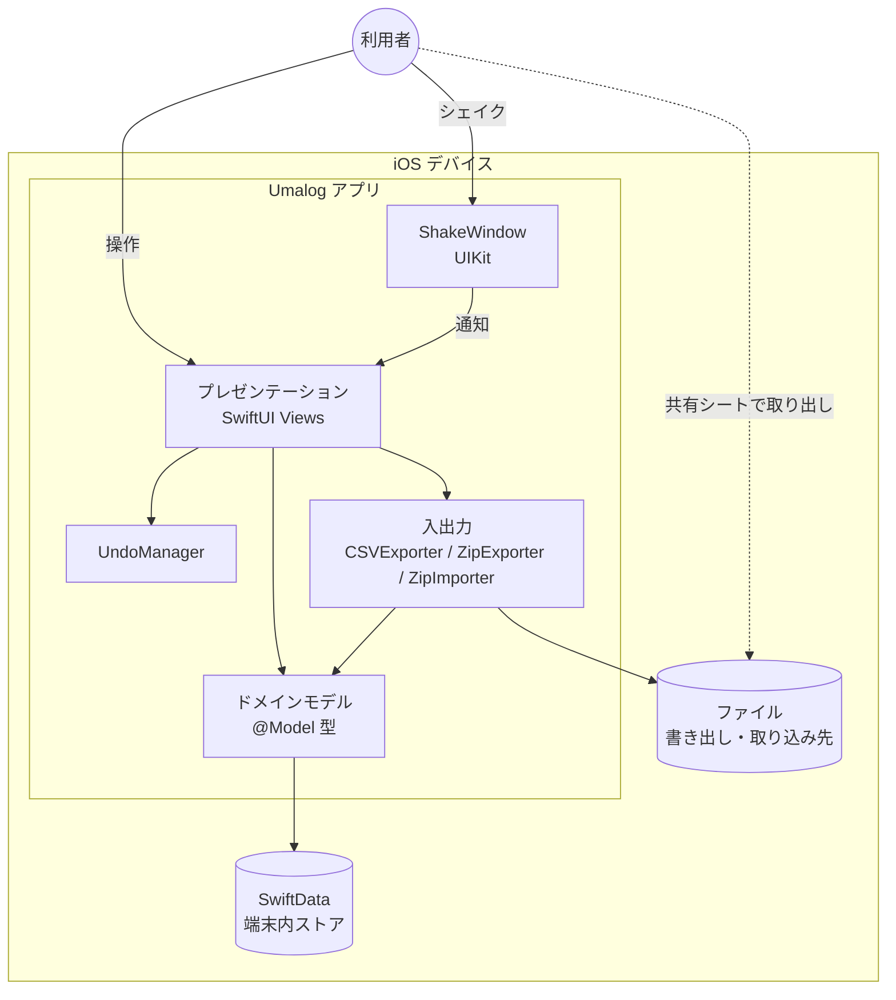
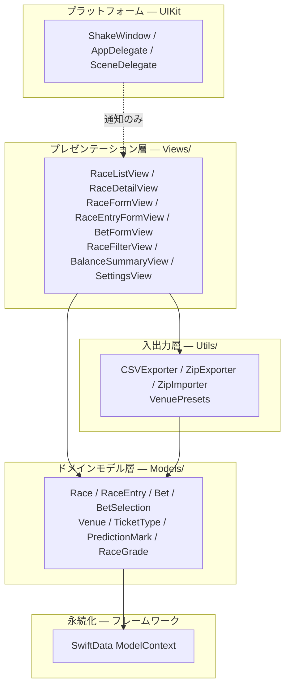

# アーキテクチャ

## 全体構成図

Umalog は単一利用者・単一デバイス向けのアプリケーションで、プロセス境界を1つしか持たない。ネットワーク通信を行う構成要素は存在しない。

外部システム・サーバー・アカウント基盤との接続は構成上存在しない。

## 技術選定と理由（ADR）

追記のみのログとして扱う。決定が変わった場合は既存の記録を書き換えず、新しい記録を追加して相互にリンクする。

### ADR-001 データの入力方法は手動入力とする

- **決定**: 出走馬などのレース情報は利用者が手で入力する。外部データソースとの連携を行わない。
- **背景**: 入力の手間を減らしたいが、自動取得は保守コストと規約上の制約を伴う。
- **却下した選択肢**:
  - JRA-VAN データラボ（公式）— 月額制かつ Windows 専用で、macOS / iOS から利用できない。
  - スクレイピング（netkeiba 等）— サイト改修で壊れやすく、利用規約の確認が必要。
  - OCR（写真・スクリーンショット）— 密な表組みで誤認識が出やすく不安定。
  - JRA 公式アプリからのコピー — ネイティブアプリのため表のテキスト選択ができない。
- **トレードオフ**: 入力の手間が残る。代わりに外部形式に依存しないため保守が不要になり、中央・地方・海外を問わず記録できる副次的な利点を得た。入力負担はオートコンプリート、開催情報の引き継ぎ、競馬場プリセットで緩和する。

### ADR-002 永続化に SwiftData を採用する

- **決定**: 端末内の永続化に SwiftData を用いる。
- **背景**: 単一デバイス・単一利用者で、リレーションを持つ構造化データを保持する必要がある。
- **却下した選択肢**: Core Data の直接利用 — SwiftUI との結線に定型コードが増える。ファイル直書き（JSON 等）— リレーションと差分更新を自前で扱うことになる。
- **トレードオフ**: SwiftData のスキーマ移行の制約を受け入れる。

### ADR-003 データモデルを最初から CloudKit 互換で設計する

- **決定**: iCloud 同期が未実装の段階から、CloudKit の制約を満たすモデル定義を強制する。
- **背景**: 同期を後から有効化する際、非互換なスキーマからの移行は破壊的かつ高リスクになる。
- **却下した選択肢**: 同期の実装時にまとめて移行する — 既存利用者の記録を失うリスクが大きい。
- **トレードオフ**: 一意制約や順序付きリレーションといった表現力を、実装当初から諦めている。具体的な制約は「不変条件・境界」を参照。

### ADR-004 データの持ち出しは ZIP バックアップと CSV エクスポートの2系統とする

- **決定**: 復元を目的とした ZIP バックアップと、他アプリへの移行・閲覧を目的とした CSV エクスポートを両方提供する。
- **背景**: 記録は関係構造を持つため、CSV へ平坦化すると完全な復元ができない。一方で、利用者を囲い込まず自分のデータを持ち出せる状態は維持したい。
- **却下した選択肢**: CSV のみ — 関係構造を復元できない。バイナリバックアップのみ — 他アプリで読めず、透明性の方針と合わない。
- **トレードオフ**: 書き出し形式が2つになり、それぞれを保守する必要がある。

### ADR-005 取り消しはシェイクジェスチャで呼び出す

- **決定**: 削除の取り消しを、デバイスを振る操作に割り当てる。UIKit の `ShakeWindow` でジェスチャを検知し、`UndoManager` に登録した復元手順を実行する。
- **背景**: 削除は取り返しがつかない操作であり、安全網が要る。一方で画面上に常設の「元に戻す」導線を置くと記録画面が煩雑になる。
- **却下した選択肢**: 画面上の Undo ボタン — 画面を圧迫する。確認ダイアログのみ — 削除後に気付いた場合に救済できない。
- **トレードオフ**: SwiftUI にシェイク検知の API がないため、この1点のためだけに UIKit へ依存する。シェイクを前提にできないプラットフォームへ展開する際は代替導線が必要になる（「不変条件・境界」を参照）。

### ADR-006 最小対応 OS を iOS 18 とする

- **決定**: deployment target を iOS 18 に置く。
- **背景**: iOS 17 は全対応端末が iOS 18 へ更新可能で実質サポート終了済み。iOS 18 なら 2018 年以降のほぼ全端末をカバーできる。
- **状態**: **ADR-007 により置き換えられた。**

### ADR-007 最小対応 OS を iOS 26 に引き上げる（ADR-006 を置き換え）

- **決定**: deployment target を iOS 26.0 とする。
- **背景**: 個人利用が主目的であり、対象端末は開発者本人の端末に限られる。旧 OS を支える利益より、最新 SDK の機能をそのまま使える利益が上回った。
- **トレードオフ**: 対応端末が大きく狭まる。App Store で公開する際の到達範囲を犠牲にしている。
- **関連**: ADR-006

### ADR-008 App Store で配信する

- **決定**: App Store 経由で配信する。配信地域は日本のみ、年齢レーティングは18+相当とする。
- **背景**: 無料 Apple ID による実機インストールは7日で失効し、再ビルドの手間が続く。ストア配信なら期限を意識しなくてよい。
- **トレードオフ**: 有料 Apple Developer Program（年額）の費用と、審査対応の手間を受け入れる。賭けを題材とするジャンルであるため、審査上の説明責任が生じる。

## レイヤー構成と依存の方向

**依存のルール**

- 依存は上から下へのみ流れる。`Models/` は `Views/` と `Utils/` を知らない。
- `Utils/` は `Views/` を知らない。入出力はモデルとファイルの間だけで完結する。
- UIKit 層からプレゼンテーション層へは、`NotificationCenter` 経由の通知のみ。逆向きの参照を持たない。
- 業務ロジックは軽量に保ち、画面がドメインモデルを直接扱う。集計・組合せ点数などの派生値はモデル側の計算プロパティとして導出する。

## 不変条件・境界

**常に成り立たなければならない約束**

- **ネットワーク通信を行うコードが存在しない。** サーバー、アカウント基盤、解析 SDK、広告 SDK のいずれも持たない。この「存在しない」ことがプライバシー要件の実体である。
- **馬券購入サービスへの導線が存在しない。** リンク・ボタン・ディープリンクのいずれも置かない。
- **機能を制限する課金が存在しない。** 課金による分岐をコード上に持たない。
- **予想印はちょうど8種。** 追加も削除もしない。1頭につき1つだけ付き、印なしを許容する。
- **収支の集計はレースの開催日を基準とする。** 記録の作成日時では集計しない。払戻が未入力の馬券は0円として扱う。
- **購入額・収支・回収率を保存しない。** すべて記録から導出する。二重管理を避けるため、独立した列や集計テーブルを持たない。

**CloudKit 互換のための制約（ADR-003）**

- すべてのリレーションシップはオプショナル（`?`）であること。
- 並び順は `sortIndex: Int = 0` で表現し、SwiftData の順序付きリレーションを使わないこと。
- `@Attribute(.unique)` を使わないこと。

**マスタと記録の境界**

- 競馬場・券種のマスタが削除されても、それを参照していた記録は残る。記録側は表示に必要な名称の控えを保持する。マスタの削除が記録の欠損を引き起こしてはならない。

**移行に関する境界**

- 記録の内部表現を変更する場合は、既存データを新形式へ移行する経路を必ず用意する。移行なしの形式変更は過去記録の欠損に直結する。
- バックアップの取り込みでは、記録を論理的なキー（開催日・競馬場・レース番号など人が識別できる属性）で突き合わせる。同一キーの記録が重複しうる設計変更を行う場合は、取り違えが起きないようキーの一意性を再検討する。

**取り消しに関する境界**

- 削除を伴う操作には「削除前の退避」と「復元手順の登録」が対で必要になる。削除できる対象を増やすときは、この対を欠かさない。
- 取り消しの呼び出しをデバイスのシェイクに依存している。シェイクを前提にできないプラットフォームへ展開する場合は、代替の取り消し導線を別途用意する。

**外部データ取得を検討する場合の境界**

- 出走馬情報などの自動取得は「ローカル完結・外部送信なし」と衝突しうる。取り込む場合も、アプリが自発的に通信しない設計（利用者が明示的に持ち込んだデータのみを扱う等）を守る。

## 共通規約

| 対象 | 規約 |
| :--- | :--- |
| 型・プロパティ・関数のコメント | DocC 形式（`///`）を必須とする。`- Returns:` `- Parameter:` `- Note:` を用いる |
| 行コメント（`//`） | 読み手が誤読しうるロジックにのみ付ける。自明なコードを説明しない |
| モデルのプロパティ | すべてデフォルト値を持つか、オプショナルであること（ADR-003） |
| 並び順 | `sortIndex: Int = 0` で表現する |
| 列挙型の既定値 | 空・未選択を表す case は `.unspecified` と命名する。`.none` は `Optional.none` と衝突する |
| 日付の扱い | 収支集計は `Calendar.current` の日境界で判定する |
| Xcode プロジェクトファイル | `.pbxproj` を手で編集しない。新規ファイルの追加は Xcode の GUI から行う |
| 画面上の操作要素 | ツールバーボタンには `accessibilityIdentifier` を設定する（UI テストからの参照に必要） |

## 非機能の実現方式

| 非機能要件 | 実現方式 |
| :--- | :--- |
| プライバシー・ローカル完結 | ネットワークを扱うコードを持たないことで構造的に担保する。ソースを公開し、外部送信がないことを検証可能にする |
| オフライン動作 | 全データを SwiftData の端末内ストアに保持する |
| データ保全 | ZIP バックアップによる書き出しと復元。加えて CSV による持ち出し |
| 操作の安全性 | `UndoManager` に復元手順を登録し、シェイクで呼び出す（ADR-005） |
| 完全無料 | サーバーを持たないため運用費が発生せず、課金なしで無制限を成立させられる |
| 審査対応 | アプリ説明文と App Review Notes に「賭け機能を持たない記録アプリである」ことを明記する |

### テスト方針

| レベル | 担保する範囲 | 実行対象 |
| :--- | :--- | :--- |
| ユニットテスト | モデルの派生値（組合せ点数・購入額・収支・回収率）、絞り込み条件、入出力の変換 | `umalogTests` |
| UI テスト | 画面の結線と操作の成立。特に新設した操作要素が実際にタップに反応すること | `umalogUITests` |

- **値型のユニットテストだけでは画面の結線を検証できない。** 新しい操作要素を追加した場合は、必ず操作レベルのテストか実機・シミュレータでの確認を伴わせる。
- テスト関数名は日本語の仕様文で書く。このため SwiftLint の `identifier_name` ルールを無効化している。
- テストケースそのものは文書化しない。テストコードを正とする。
- 実行コマンドは `AGENTS.md` の Commands を参照する。

### 依存パッケージ

| パッケージ | 用途 |
| :--- | :--- |
| swift-markdown-ui | Markdown メモの表示 |
| cmark-gfm | 上記の Markdown 解析基盤 |
| NetworkImage | 上記の依存として同梱される |
| ZIPFoundation | ZIP バックアップの書き出しと取り込み |
