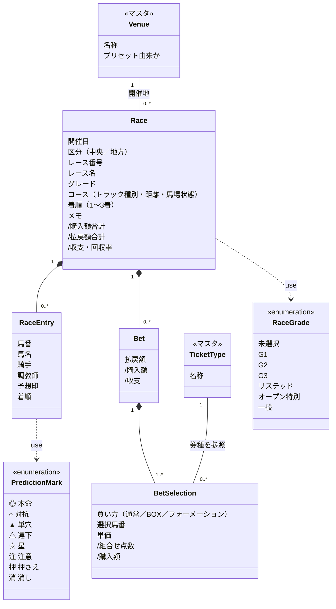
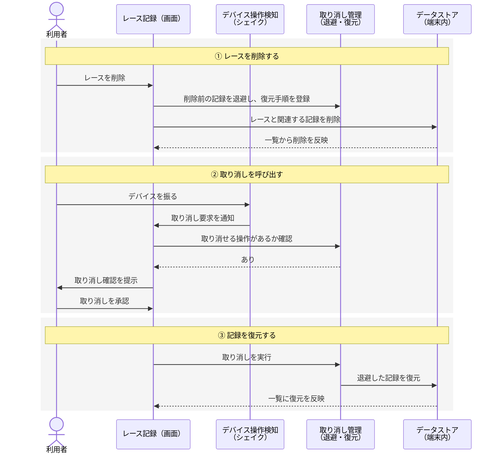
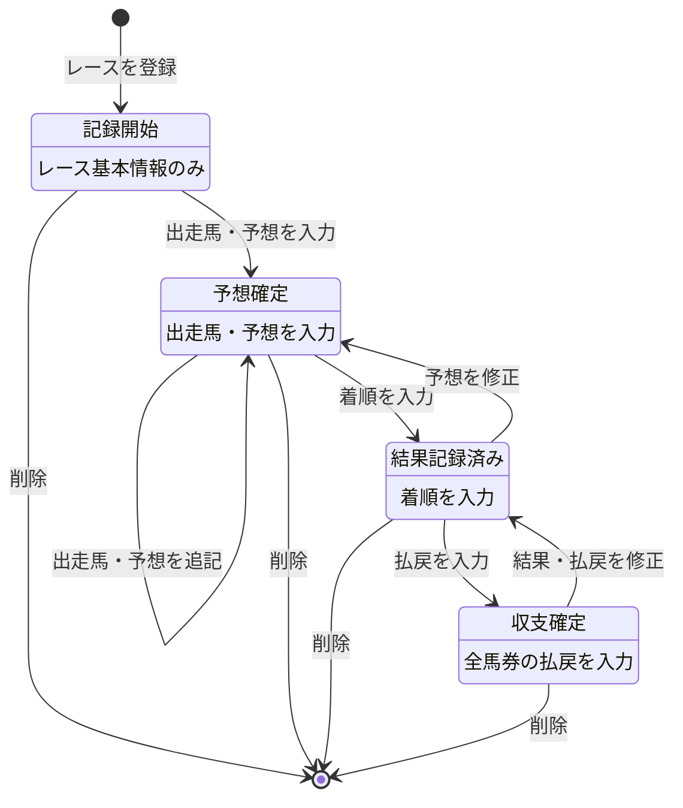

# 詳細設計

## モジュール・クラス構成

記録対象の概念とその関係を示す。属性は論点になるものだけを挙げ、実装上の型は省いている。

**関係の強さ**

- レースと出走馬・馬券、馬券と買い目は**コンポジション**。親を消せば子も消える一体の記録であり、削除規則は `.cascade`。
- 競馬場・券種と記録の間は**参照**。片方を消してももう片方は独立して残る（削除規則は `.nullify`）。名称の控えを記録側が持つため、マスタが消えても表示は保たれる。

**派生値の所在**

| 派生値 | 導出元 |
| :--- | :--- |
| 買い目の組合せ点数 | 買い方と選択馬番。券種ごとに組合せの数え方が異なる |
| 買い目の購入額 | 単価 × 組合せ点数 |
| 馬券の購入額 | 配下の買い目の購入額の合計 |
| 馬券の収支 | 払戻額 − 購入額 |
| レースの購入額・払戻額・収支・回収率 | 配下の馬券の合計 |

## 主要な処理の流れ

本アプリを特徴づけるのは「削除と、その取り消し」である。削除を即座に確定させず、常に「退避 → 確認 → 復元」の余地を残す。

**例外時の分岐**

- 取り消せる操作が無い場合、シェイクを検知しても確認は提示せず、何も起こさない。
- 利用者が確認を拒否した場合、退避した記録はそのまま破棄される。

**実装上の勘所**

- 確認ダイアログが閉じるアニメーションの最中に一覧を更新すると、リストの差分計算が破綻する。復元はダイアログの dismiss 完了を待ってから実行する。

## 状態遷移

1件のレース記録が、記録作業の進行に伴ってたどるライフサイクル。これは記録の充足度から導かれる**概念的な状態**であり、状態区分をデータとして保持しているわけではない。

各段階は前後に自由に行き来でき、後から予想や結果を修正できる。削除はいずれの段階からも可能で、取り消しによって元の状態へ復元できる。

**起きてはならない遷移**

- 段階を飛ばして状態が進むことはない。ただしこれは制約ではなく、入力の充足度から状態が決まる結果に過ぎない。着順だけを先に入力すれば、出走馬が未登録のまま「結果記録済み」相当になる。**画面はこの中間状態を破綻せずに表示できなければならない。**
- 削除された記録が、取り消しを経ずに再び現れることはない。

## データアクセス設計

| 観点 | 方針 |
| :--- | :--- |
| 永続化 | SwiftData の `ModelContext` を通じて行う。画面は `@Query` でモデルを直接購読する |
| 取得 | レース一覧は開催日で整列して取得する。絞り込みは取得後のコレクションに対して適用する |
| 絞り込みの評価 | 各条件を独立した述語として実装し、AND で合成する。条件が未設定なら常に真を返す |
| 更新の単位 | 画面上の1操作を1回の保存にまとめる。部分的に保存された中途半端な状態を残さない |
| 削除 | 親を削除すると子も削除される（`.cascade`）。マスタの削除は参照を切るだけで記録を消さない（`.nullify`） |
| 排他制御 | 単一利用者・単一デバイスのため、競合を前提とした制御を行わない |

**`ModelContainer` の扱い**

- `ModelContainer` は必ず名前付きの変数に保持してから `mainContext` を取り出す。生成式に続けて `mainContext` を参照すると、コンテナが即座に解放される。

## テスト観点

| 対象 | 壊れやすい点・確かめるべきこと |
| :--- | :--- |
| 組合せ点数 | 券種ごとに数え方が異なる。BOX とフォーメーションで重複した組合せを二重に数えていないか |
| 収支集計 | 集計がレースの**開催日**基準になっているか。払戻未入力が0円として扱われているか |
| 回収率 | 購入額が0のときに破綻しないか |
| 絞り込み | 各条件が AND で合成されているか。未設定の条件が結果を狭めていないか。結果が常に入力の部分集合になっているか |
| 予想印 | 8種すべてが往復変換できるか。未設定（印なし）を維持できるか |
| バックアップ | 書き出したファイルから記録を復元できるか。旧形式のファイル名を読めるか |
| 削除と取り消し | 削除した記録が関連する子ごと復元されるか |
| 画面の結線 | 新設した操作要素が実際にタップ・入力に反応するか（値型のテストでは検出できない） |
