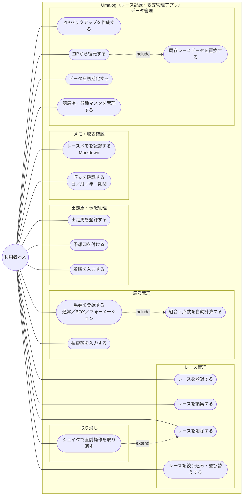
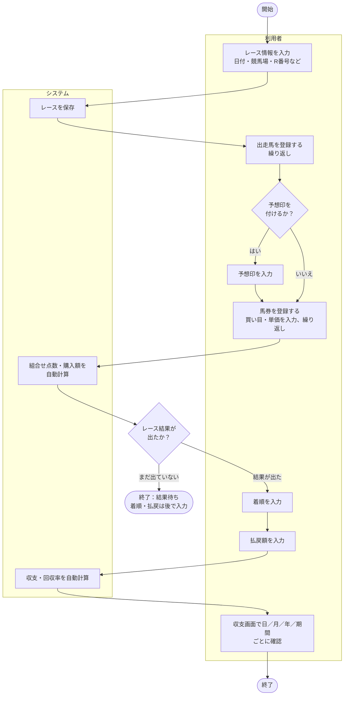

# 要件定義

## 目的・背景

競馬の予想と収支を記録する手段が、いま2つに分断されている。

- **予想・メモ寄りのアプリ**は収支・回収率まで面倒を見ないため、収支は別アプリや表計算で補うことになる。
- **収支管理寄りのアプリ**は予想印やレースの所感を残す場所がない。

結果として「どう予想して、いくら賭けて、いくら返ってきたか」が1か所に揃わない。Umalog はこの3つを1本に統合し、**予想印・メモ・収支を同じレース記録の上で扱えるようにする**ことを目的とする。

加えて、収支は金銭情報であるため、外部に預けたくないという要求がある。既存アプリの多くはアカウント登録とクラウド保存が前提で、この要求を満たせない。Umalog は**端末内のみにデータを保持する**ことでこれに応える。

## 想定利用者

| 役割 | 達成したいこと |
| :--- | :--- |
| 開発者本人（主たる利用者） | 自分の予想と収支を1つのアプリで記録し、日／月／年で振り返る |
| プライバシー志向の手動派ユーザー | 無料・広告なし・データを外に出さない前提で、予想から収支まで自己完結して管理する |

単一利用者・単一デバイスを前提とする。複数人での共有・共同編集は想定しない。

## 機能要件

| 機能 | 内容 | 受け入れ基準 |
| :--- | :--- | :--- |
| レース記録の管理 | レースの登録・編集・削除、一覧の絞り込みと並び替え | 中央・地方を問わず登録でき、絞り込み条件は互いに AND で効く |
| 出走馬・予想の記録 | 出走馬の登録、予想印の付与、着順の入力 | 予想印は8種から1頭につき1つだけ選べる。印なしも許容される |
| 馬券の記録 | 馬券の登録（通常／BOX／フォーメーション）と払戻額の入力 | 買い目と単価から組合せ点数・購入額が自動算出される |
| メモの記録 | レース単位の自由記述メモ（Markdown） | Markdown として記述・表示できる |
| 収支の集計 | 日／月／年／任意期間での収支と回収率の表示 | 「払戻合計 − 購入合計」がレース開催日を基準に集計される。未確定の馬券は払戻0円として扱う |
| データの持ち出し | ZIP バックアップの作成・復元、CSV エクスポート | 書き出したファイルから記録を復元できる。復元時は既存データの置換として扱う |
| マスタ管理 | 競馬場・券種の追加・編集 | 中央・地方の競馬場がプリセットとして最初から入っている |
| 取り消し | 直前の削除操作の取り消し | 削除後にデバイスを振ると、削除した記録を元に戻せる |
| ライセンス表示 | 利用しているオープンソースパッケージのライセンス表示 | 依存パッケージ名とライセンス本文をアプリ内で確認できる |

### システムの範囲

アクターは利用者本人ただ1人で、外部システムや他者は関与しない。

### 業務フロー

レース登録から収支確認までの基本的な流れ。予想印の入力は任意で、結果が未確定の時点で一旦終了してよい。

## 非機能要件

| 区分 | 要件 |
| :--- | :--- |
| プライバシー | データは端末内に閉じ、外部へ送信しない。アプリ独自のアカウントを持たない。開発者はデータにアクセスできない |
| 可用性 | ネットワーク非依存。オフラインで全機能が動作する |
| 費用 | 完全無料・無制限。機能を課金でゲートしない |
| 対応範囲 | 中央（JRA）・地方（NAR 等）を問わず記録できる。手入力のため主催者に依存しない |
| データ保全 | 記録の内部表現を変更する場合も、既存データを失わずに移行できること |
| 操作の安全性 | 削除操作は取り消せること |
| 配信 | App Store 経由。配信地域は日本のみ、年齢レーティングは18+相当 |

実現方式は [architecture.md](architecture.md) を参照。

## スコープ外

**永久に作らないもの（非交渉事項）**

- 馬券購入・賭けの仲介・送金といった賭け行為そのものの機能
- 馬券購入サイト（即PAT / IPAT 等）への導線・リンク・ボタン
- アプリ独自のユーザーアカウント、開発者が保有するサーバー
- 機能を制限する課金（フリーミアム）

**現時点では作らないもの**

- iCloud 同期（任意機能として方針は確定・未実装。有料 Apple Developer Program 加入が前提）
- 出走馬情報の外部からの自動取得（取得元と利用規約の判断が未了）
- macOS / iPadOS 対応
- 任意課金による「お布施」（機能はゲートしない前提での投げ銭）

## 用語集

| 用語 | 意味 |
| :--- | :--- |
| レース | 記録の中心単位。開催日・競馬場・レース番号で識別する |
| 出走馬 | あるレースに出走した1頭の記録。馬番・馬名・騎手・予想印・着順を持つ |
| 予想印 | 出走馬に付ける8種の評価記号（◎ ○ ▲ △ ☆ 注 押 消）。1頭につき1つ |
| 馬券 | 1レースに対して投じた1件の購入記録。1つ以上の買い目から成る |
| 買い目 | 馬券を構成する1件の選択。券種・買い方・選択馬番・単価を持つ |
| 買い方 | 買い目の展開方式。通常／BOX／フォーメーションの3種 |
| 組合せ点数 | 買い方と選択馬番から算出される、その買い目が含む組合せの数 |
| 券種 | 単勝・馬連・三連単などの馬券の種類。マスタとして編集できる |
| 収支 | 払戻額の合計 − 購入額の合計 |
| 回収率 | 払戻額の合計 ÷ 購入額の合計 |
| 中央／地方 | 主催者による区分。中央は JRA、地方は NAR 等 |
