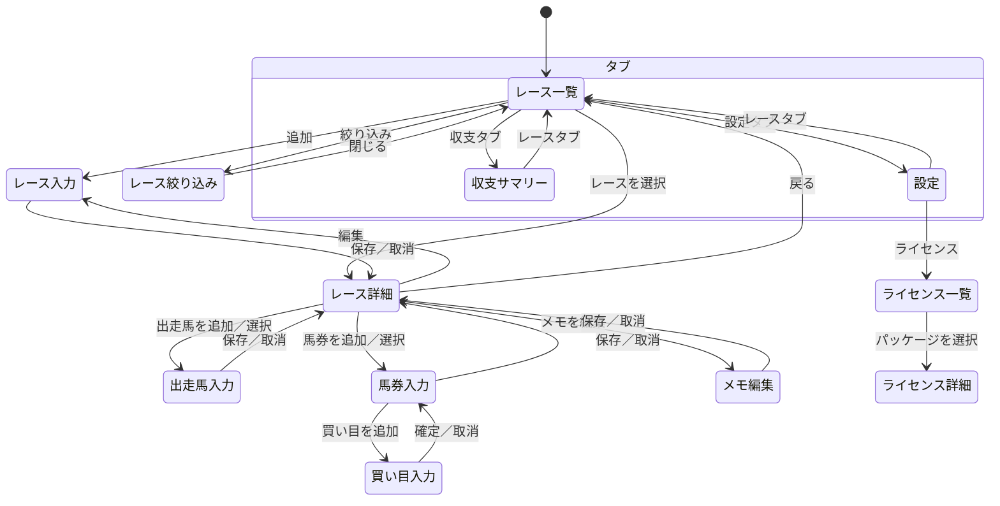
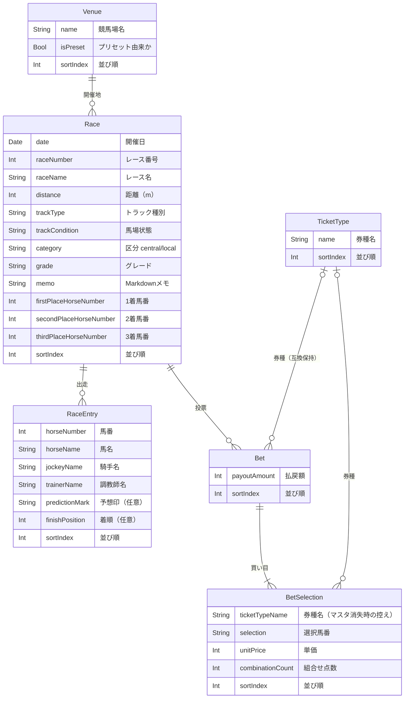

# 仕様

## 機能一覧

[requirements.md](requirements.md) の機能要件を、実装される単位に分解したもの。

| # | 機能 | 分解した内容 |
| :--- | :--- | :--- |
| 1 | レース記録の管理 | レース一覧の表示、登録、編集、削除、絞り込み（競馬場・区分・グレード・日付範囲） |
| 2 | 出走馬・予想の記録 | 出走馬の追加・編集・削除、予想印の付与と解除、着順（1〜3着）の記録 |
| 3 | 馬券の記録 | 馬券の追加・編集・削除、買い目の追加、買い方の選択、組合せ点数と購入額の自動算出、払戻額の入力 |
| 4 | メモの記録 | レース単位の Markdown メモの編集と表示 |
| 5 | 収支の集計 | 日／月／年／全期間の収支・回収率の表示 |
| 6 | データの持ち出し | ZIP バックアップの書き出しと取り込み、CSV エクスポート |
| 7 | マスタ管理 | 競馬場の追加・編集・削除、券種の追加・編集・削除 |
| 8 | 取り消し | 削除操作の退避と、シェイクによる復元 |
| 9 | ライセンス表示 | 利用しているオープンソースパッケージの一覧と本文表示 |

## 画面仕様

3つのタブを起点とする。

| 画面 | 役割 | 主な入出力項目 |
| :--- | :--- | :--- |
| レース一覧 | ホーム。登録済みレースを開催日順に並べる | 出力: 開催日・競馬場・R番号・レース名・収支。操作: 追加、絞り込み、スワイプ削除 |
| レース絞り込み | 一覧の絞り込み条件を設定するシート | 入力: 競馬場（複数選択）・区分（中央／地方）・グレード（複数選択）・開始日・終了日 |
| レース詳細 | 1レースの全記録を集約して表示 | 出力: レース情報・出走馬一覧・馬券一覧・メモ・収支。操作: 各記録の追加と編集 |
| レース入力 | レースの登録・編集シート | 入力: 開催日・競馬場・区分・R番号・レース名・グレード・距離・トラック種別・馬場状態・着順（1〜3着） |
| 出走馬入力 | 出走馬の登録・編集シート | 入力: 馬番・馬名・騎手・調教師・予想印・着順 |
| 馬券入力 | 馬券の登録・編集シート | 入力: 買い目リスト・払戻額。出力: 組合せ点数・購入額 |
| 買い目入力 | 買い目1件の入力シート | 入力: 券種・買い方・選択馬番・単価 |
| メモ編集 | Markdown メモの編集シート | 入力: メモ本文 |
| 収支サマリー | 期間別の収支を集計して表示 | 入力: 集計期間の選択。出力: 購入合計・払戻合計・収支・回収率 |
| 設定 | マスタ管理とデータ管理 | 操作: 競馬場・券種の編集、ZIP 書き出し／取り込み、CSV 書き出し、データ初期化 |
| ライセンス一覧／詳細 | 依存パッケージのライセンス表示 | 出力: パッケージ名、ライセンス本文 |

入力チェックは各入力画面で行い、必須項目が欠けている場合は保存操作を無効化する。

### 画面遷移

## データモデル

レースを中心に、出走馬と馬券がぶら下がる。競馬場と券種はマスタとして参照される。

**項目定義の補足**

| 項目 | 定義 |
| :--- | :--- |
| `category` | `central`（中央）または `local`（地方） |
| `grade` | 未選択 / `G1` / `G2` / `G3` / `Listed` / `OpenSpecial` / `General` |
| `predictionMark` | ◎ ○ ▲ △ ☆ 注 押 消 の8種。未設定（印なし）を許容する |
| `trackType` | `turf`（芝）または `dirt`（ダート） |
| 購入額・収支・回収率 | 保持しない。買い目の単価と組合せ点数、および払戻額から都度導出する |
| `ticketTypeName` | マスタ（`TicketType`）が削除されても券種名が読めるよう、記録側に控えを持つ |

`Bet` 側の券種・買い目・単価は、買い目を `BetSelection` へ分離する前の形式で保存された記録を読むために残している。新規の記録は `BetSelection` 側に持つ。

## エラー・メッセージ仕様

| 場面 | 条件 | 文面の要旨 |
| :--- | :--- | :--- |
| 削除の取り消し | シェイク検知時に取り消せる操作がある | 「〈操作名〉を取り消しますか？」／取り消す・キャンセル |
| 削除の取り消し | 取り消せる操作の名前が取得できない | 「最後の操作を取り消しますか？」 |
| レース一覧 | 絞り込み条件に合致するレースが0件 | 「条件に一致するレースがありません」 |
| ZIP 取り込み | 取り込みを実行すると既存レースが置き換わる | 置換される旨を提示し、承認を求める |
| データ初期化 | 全記録を削除する | 取り消せない旨を提示し、承認を求める |

外部連携を行わないため、通信・認証に関するエラーは存在しない（[architecture.md](architecture.md) の不変条件を参照）。
